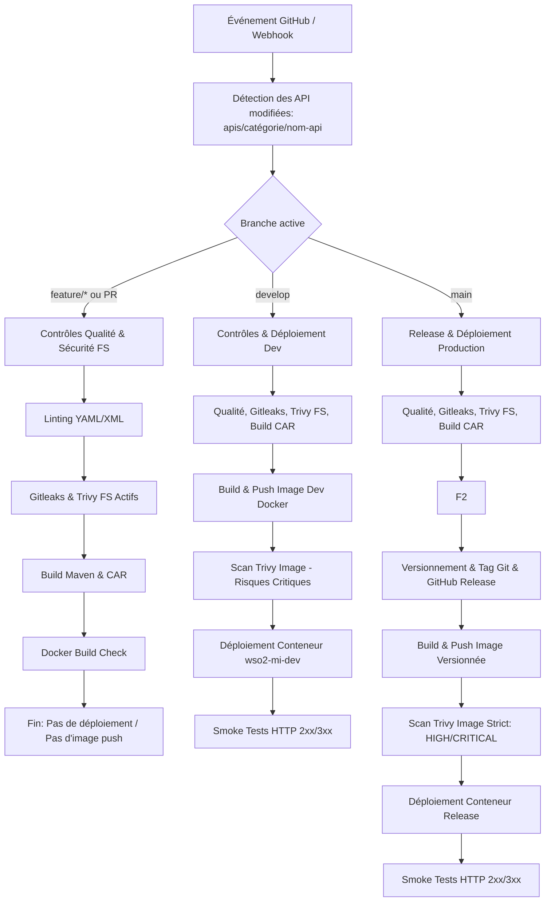

# Avenant au Cahier des Charges (Addendum & Mise à Jour Technique)

**Projet :** Pipeline CI/CD Jenkins pour la compilation, le test et le déploiement des API WSO2 Micro Integrator  
**Document :** Addendum au Cahier des Charges v4.0  
**Auteur :** Oubeyd Kechiche (Stagiaire DevOps)  
**Encadrante :** Imen Frigui  
**Organisme d'accueil :** Inetum  
**Date :** Juillet 2026  
**Version :** 4.0 (Addendum - Fonctionnalités Sécurité Intégrées)

---

## 1. Introduction et Objet de l'Avenant

Le présent document constitue un avenant technique (addendum) au cahier des charges initial du projet d'automatisation CI/CD pour la plateforme d'intégration WSO2 Micro Integrator (MI).

À la suite de l'évolution des choix d'infrastructure au sein de l'entreprise hôte, le moteur d'exécution CI/CD est passé d'une solution basée sur **GitHub Actions** à une architecture centralisée s'appuyant sur **Jenkins**. Parallèlement, des fonctionnalités clés d'ingénierie DevOps et DevSecOps ont été intégrées (scans de sécurité avancés **Gitleaks** et **Trivy** désormais **pleinement opérationnels**, stratégie de promotion de branches, tests de fumée basés sur les artefacts XML, gestion dynamique des versions et conteneurisation Docker intégrale).

Ce document spécifie exclusivement les éléments modifiés, ajoutés ou reformulés depuis la version initiale. Il s'ajoute au document d'origine sans le remplacer dans son intégralité.

---

## 2. Migration de GitHub Actions vers Jenkins

### 2.1 Remplacement du moteur d'exécution
- L'ensemble des workflows d'intégration et de déploiement continus est désormais orchestré par **Jenkins**, configuré sous la forme d'un projet **Jenkins Multibranch Pipeline**.
- La définition du pipeline est centralisée dans le fichier `Jenkinsfile` situé à la racine du dépôt Git, assisté par des bibliothèques Groovy réutilisables placées dans le répertoire `jenkins/lib/`.
- GitHub Actions n'est plus utilisé comme moteur d'exécution CI/CD ; GitHub conserve uniquement son rôle de gestionnaire de code source (SCM) et d'émetteur d'événements.

### 2.2 Déclenchement par Webhook et exposition locale
- **Déclenchement automatique :** Jenkins est notifié en temps réel des événements de code (`push` et `pull_request`) grâce à un Webhook GitHub configuré vers l'endpoint `/github-webhook/` de Jenkins.
- **Environnement de développement local :** Lors des phases de test ou de développement local sur l'agent Jenkins, l'instance Jenkins n'étant pas directement accessible depuis l'Internet public, le Webhook est exposé au moyen de **ngrok** (tunnel HTTP temporaire). En environnement de production, l'accès au Webhook s'effectue directement via l'infrastructure réseau de l'entreprise.

---

## 3. Flux de Promotion des Branches et Protection GitHub

### 3.1 Flux de promotion imposé
Le pipeline applique et exige le respect strict du flux de promotion de code suivant :

$$\text{feature/*} \longrightarrow \text{develop} \longrightarrow \text{main}$$

- **Branches de fonctionnalités (`feature/*`) :** Branches de travail créées par les développeurs. Chaque push déclenche une validation de qualité, de sécurité (Gitleaks + Trivy FS) et de compilation par Jenkins.
- **Pull Requests vers `develop` :** Toute modification destinée à la branche d'intégration doit faire l'objet d'une Pull Request ciblant `develop`.
- **Branche d'intégration (`develop`) :** Branche de convergence des développements. Jenkins y valide le code, effectue les scans de sécurité (Gitleaks, Trivy FS et Trivy Image), génère l'image Docker de développement, la déploie sur l'environnement de dev et exécute les tests de fumée.
- **Pull Requests vers `main` :** La livraison en production nécessite une Pull Request de `develop` vers `main`.
- **Branche de livraison (`main`) :** Branche de release officielle. Jenkins y exécute la chaîne complète de livraison (versionnement, marquage Git, publication des images conteneurisées, scans stricts Gitleaks + Trivy Image bloquant sur vulnérabilités HIGH/CRITICAL, déploiement et tests de fumée).

### 3.2 Protection des branches sur GitHub
Afin de garantir l'intégrité du code et d'empêcher les contournements de la chaîne CI/CD :
- Les règles de **GitHub Branch Protection** sont appliquées sur les branches permanentes `develop` et `main`.
- **Contraintes appliquées sur `develop` et `main` :**
  1. Interdiction stricte des pushs directs (`direct push blocked`).
  2. Obligation d'effectuer les modifications via une Pull Request.
  3. Obligation de validation préalable par le statut de succès des contrôles Jenkins (*Status checks required to pass*).
- Les branches `feature/*` ne font pas l'objet de règles de protection bloquantes, étant considérées comme des branches de travail temporaires.

---

## 4. Comportement Spécifique du Pipeline par Branche

Le comportement du pipeline Jenkins s'adapte dynamiquement selon le type de branche ayant déclenché l'exécution.



### 4.1 Détail des phases par branche

| Étape / Fonctionnalité | Branche `feature/*` | Branche `develop` | Branche `main` |
| :--- | :--- | :--- | :--- |
| **Détection d'API modifiées** | Oui (`apis/*/*`) | Oui (`apis/*/*`) | Oui (`apis/*/*`) |
| **Contrôles Qualité (YAML/XML)** | Oui | Oui | Oui |
| **Détection de secrets (Gitleaks)** | Oui (Actif) | Oui (Actif) | Oui (Actif) |
| **Scan de vulnérabilités FS (Trivy)** | Oui (Actif) | Oui (Actif) | Oui (Actif) |
| **Build Maven & Packaging CAR** | Oui | Oui | Oui |
| **Docker Build Check (Local)** | Oui | Non (Build direct) | Non (Build direct) |
| **Publication Image Docker** | Non | Oui (`dev-${BUILD_NUMBER}`) | Oui (`vX.Y.Z-shortSHA`) |
| **Scan d'image Docker (Trivy)** | Non | Oui (Blocage critique) | Oui (Strict: HIGH/CRITICAL) |
| **Tag Git & Release GitHub** | Non | Non | Oui |
| **Déploiement Conteneur MI** | Non | Oui (`wso2-mi-dev`) | Oui (`<api-slug>-release`) |
| **Tests de fumée (Smoke Tests)** | Non | Oui | Oui |

---

## 5. Détection Ciblée des API Modifiées (Monorepo)

Le dépôt du projet est structuré sous la forme d'un monorepo contenant plusieurs services d'intégration sous l'arborescence :
`apis/<category>/<api-name>/`

- **Optimisation des builds :** Le pipeline n'exécute plus la compilation intégrale de toutes les API à chaque événement.
- **Mécanisme :** À l'aide de scripts Groovy dédiés (`detectChangedApis.groovy`), Jenkins analyse la portée des fichiers modifiés dans le commit ou la Pull Request (`git diff`).
- **Périmètre d'action :** Seuls les projets d'API ayant subi des modifications sont validés, compilés (génération du fichier CAR), scannés (Gitleaks et Trivy), conteneurisés et déployés. Si aucun artefact sous `apis/` n'a été modifié, l'exécution s'interrompt rapidement sans consommer de ressources d'agent.

---

## 6. Politique de Linting YAML pour les Fichiers Générés par WSO2

- **Constat technique :** L'outil d'ingénierie WSO2 Integration Studio génère automatiquement des fichiers de métadonnées et de définition d'API au format YAML. Ces fichiers sont valides et parfaitement interprétés par le runtime WSO2 MI, mais ils enfreignent parfois les règles de style strictes appliquées par des outils de nettoyage comme `yamllint`.
- **Décision d'architecture :** Il a été décidé d'utiliser une configuration personnalisée `.yamllint` à la racine du projet.
- **Implémentation :** Cette configuration conserve un niveau d'exigence élevé pour tous les fichiers YAML rédigés à la main par les développeurs (configurations de pipeline, scripts, etc.), tout en assouplissant ou excluant les fichiers YAML issus des générateurs WSO2.
- **Règle d'exploitation :** Il est strictement déconseillé d'imposer aux développeurs la retouche manuelle des fichiers générés par WSO2 pour le seul motif de satisfaire le linter.

---

## 7. Runtime WSO2 MI Basé sur Docker & Exigences de l'Agent Windows

### 7.1 Exécution runtime par conteneurisation
- La validation et l'exécution en environnement d'intégration s'effectuent intégralement sous Docker.
- Le runtime WSO2 Micro Integrator est démarré à partir d'images Docker construites dynamiquement, qui embarquent les archives CAR produites lors des étapes précédentes.
- L'utilisation directe de scripts batch locaux (`.bat`) pour démarrer le serveur WSO2 MI est totalement abandonnée au niveau du pipeline CI/CD.

### 7.2 Configuration et prérequis de l'agent Jenkins Windows
L'agent d'exécution Jenkins sous Windows (label `wso2-dev-server`) doit respecter la configuration suivante :
1. **Outillage obligatoire :**
   - **Docker** (Docker Desktop ou Docker Engine fonctionnel et actif).
   - **Trivy** (exécutable accessible dans le système).
   - **Gitleaks** (exécutable accessible dans le système).
2. **Connectivité :** L'agent communique avec le serveur maître Jenkins via le composant `agent.jar` en utilisant le protocole **WebSocket**.
3. **Mise à jour d'environnement :** En cas d'installation de nouveaux outils CLI ou de modification de la variable d'environnement système `PATH`, le service de l'agent Jenkins doit être **redémarré** pour prendre en compte les nouveaux exécutables.

---

## 8. Dispositif de Sécurité Intégré et Opérationnel (DevSecOps)

> [!IMPORTANT]
> Les outils **Gitleaks** et **Trivy** ne sont plus des éléments de la feuille de route future (roadmap), mais sont désormais **pleinement intégrés, configurés et actifs** dans le pipeline CI/CD Jenkins.

### 8.1 Outils et fonctions opérationnelles
1. **Gitleaks (Détection de secrets) :** Analyse automatique du code et de l'historique des commits pour empêcher la fuite d'identifiants, clés d'API et jetons.
2. **Trivy Filesystem (FS) Scan :** Analyse statique automatique des vulnérabilités dans le code source et les dépendances projet (fichiers POM, bibliothèques).
3. **Trivy Image Scan :** Analyse approfondie des images Docker construites pour détecter les vulnérabilités du système d'exploitation de base et des bibliothèques runtime.

### 8.2 Politique de sécurité appliquée par branche
- **Feature (`feature/*`) :** Exécution systématique de Gitleaks et du scan Trivy Filesystem (analyse statique rapide).
- **Develop (`develop`) :** Exécution complète (Gitleaks, Trivy FS et Trivy Image) avec blocage automatique des vulnérabilités de criticité maximale.
- **Main (`main`) :** Politique de sécurité renforcée. Le scan Trivy d'image bloque le pipeline et empêche la release dès la présence de vulnérabilités classées **HIGH** ou **CRITICAL**.

### 8.3 Cache persistant Trivy
Afin d'éviter le téléchargement répétitif des bases de données de vulnérabilités et d'optimiser les temps d'exécution, Trivy s'appuie sur un dossier de cache persistant configuré sur l'agent Windows :  
`C:\trivy-cache`

---

## 9. Tests de Fumée Automatisés (Smoke Testing)

### 9.1 Principe d'exécution
Des tests de fumée (Smoke Tests) s'exécutent automatiquement immédiatement après le déploiement du conteneur WSO2 MI (sur les branches `develop` et `main`).

### 9.2 Résolution dynamique des contextes d'API
- Le pipeline n'utilise pas de noms de chemins codés en dur ni de déductions basées sur le nom des dossiers.
- Le script `smokeTest.groovy` extrait dynamiquement les contextes d'API déclarés directement dans les fichiers de définition XML d'artefacts WSO2 :  
  `apis/<category>/<api-name>/src/main/wso2mi/artifacts/apis/*.xml`
- Les requêtes HTTP de validation sont adressées à l'URL :  
  `URL_DE_BASE + Contexte_API` (par exemple : `http://localhost:8290/order/v1`)

### 9.3 Critères d'acceptation et diagnostic d'échec
- **Succès :** Une réponse HTTP avec un code de statut `2xx` ou `3xx` confirme que l'API est correctement déployée et opérationnelle.
- **Échec :** Un code retour `404` indique que le contexte de l'API n'est pas exposé ou est mal configuré.
- **Affichage des logs en cas d'erreur :** Si un test de fumée échoue, le pipeline Jenkins interroge immédiatement le conteneur Docker MI et affiche automatiquement ses logs d'exécution dans la console Jenkins (`docker logs <conteneur>`), permettant un diagnostic immédiat sans connexion manuelle à l'agent.

---

## 10. Gestion Sécurisée des Identifiants (Jenkins Credentials)

- Tous les identifiants et jetons d'accès nécessaires au pipeline sont centralisés de manière sécurisée dans le gestionnaire de clés **Jenkins Credentials** :
  - **Token GitHub (`GIT_CRED_ID`) :** Utilisé pour l'accès au dépôt, la mise à jour des statuts de commit, la création des tags Git et la publication des Releases GitHub.
  - **Token / Identifiants Docker Hub (`REGISTRY_CRED_ID`) :** Utilisés pour l'authentification et le push des images conteneurisées vers le registre.
- **Interdiction stricte :** Aucun identifiant, clé privée ou secret ne doit être stocké dans le code source du projet, dans le `Jenkinsfile` ou dans les scripts Groovy. Gitleaks contrôle l'application stricte de cette règle.

---

## 11. Gestion des Versionnements, Releases et Correction du SHA Git

### 11.1 Processus de Release sur la branche Main
Lors d'une exécution réussie sur la branche `main`, le pipeline exécute automatiquement :
1. La création d'un **Tag Git** au format de versionnement sémantique.
2. La publication d'une **Release GitHub** contenant le changelog de la version.
3. La construction et le push d'une **image Docker versionnée**.

### 11.2 Convention de nommage des images Docker
Les étiquettes (tags) des images Docker produites incluent le numéro de version ainsi que le SHA court du commit Git associé, garantissant une traçabilité parfaite entre l'image déployée et le code source :  
`<registry>/<api-slug>:v<version>-<shortSHA>`  
*Exemple :* `oubeyd/order-api-product-api:v0.1.0-fa78fa3a`

### 11.3 Correction de la résolution du SHA Git
- **Problème identifié :** Dans certaines configurations d'exécution Jenkins (notamment lors de déclenchements par webhook ou checkout léger), la variable d'environnement `GIT_COMMIT` n'était pas renseignée par le plugin, provoquant des erreurs de marquage avec des mentions du type `unknown SHA`.
- **Solution apportée :** Le pipeline inclut désormais un mécanisme de fallback robuste qui interroge directement Git (`git rev-parse HEAD`) lorsque la variable Jenkins `GIT_COMMIT` n'est pas initialisée :
  ```groovy
  env.SOURCE_COMMIT = env.GIT_COMMIT ?: sh(script: 'git rev-parse HEAD', returnStdout: true).trim()
  ```

---

## 12. Synthèse des Modifications apportées au Cahier des Charges

| Rubrique | Statut | Synthèse de la modification |
| :--- | :--- | :--- |
| **Moteur CI/CD** | Modifié | Passage de GitHub Actions à Jenkins Multibranch Pipeline avec Webhooks. |
| **Flux Git** | Précisé | Imposition du flux `feature/*` -> `develop` -> `main` et règles de Branch Protection. |
| **Logique par branche** | Ajouté | Validation sur `feature`, build/deploy/smoke test sur `develop`, release sur `main`. |
| **Scope des builds** | Modifié | Détection ciblée des API modifiées sous `apis/*/*` (pas de build global). |
| **Qualité YAML** | Modifié | Règle `.yamllint` assouplie pour les métadonnées générées par WSO2 Studio. |
| **Runtime MI** | Modifié | Conteneurisation Docker intégrale ; abandon des scripts batch `.bat` locaux. |
| **Sécurité (Gitleaks/Trivy)** | **Intégré & Opérationnel** | Gitleaks (secrets) et Trivy (scans FS et images Docker) **pleinement déployés et actifs** (non plus en roadmap). |
| **Tests de fumée** | Ajouté | Résolution dynamique des contextes XML d'API, tests HTTP et dump des logs Docker. |
| **Identifiants** | Précisé | Gestion 100% centralisée dans Jenkins Credentials (GitHub & Docker Hub). |
| **Versionnement** | Modifié | Tags Git, GitHub Releases et correction du fallback SHA via `git rev-parse HEAD`. |
| **Agent Windows** | Ajouté | Installation requise de Docker, Trivy, Gitleaks et connexion WebSocket. |
